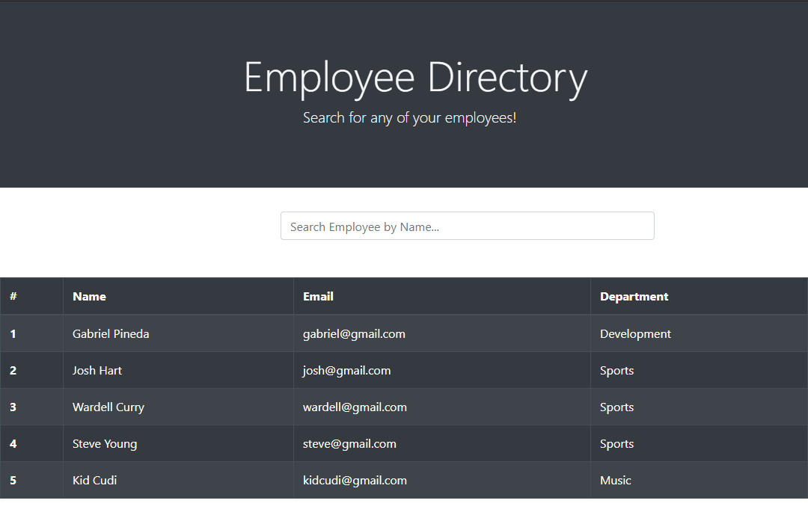

# Employee Directory
In this application I used react native to createa smile website that allows the user to navigate through their directory of employees while also being able to search that employee by name or by organizing the table
by department being alphabetized.

## Image of the APP

## Built With

* [React](https://www.react.com/)
* [Javascript](https://www.javascript.com/)
* [Node.js](https://nodejs.org/en/)
* [NPM](https://www.npmjs.com/)

## Deployed Site
- [Directory App](https://gabrielpineda808.github.io/employee-directory)
## Github Repository
- [Memory Game Repo](https://github.com/GabrielPineda808/employee-directory)

## Authors

* **Gabriel Pineda** 

- [Link to Github](https://github.com/GabrielPineda808)
- [Link to LinkedIn](https://www.linkedin.com/in/gabriel-pineda-a94535195/)